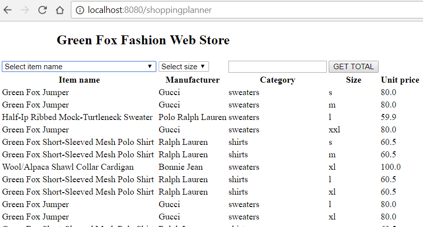
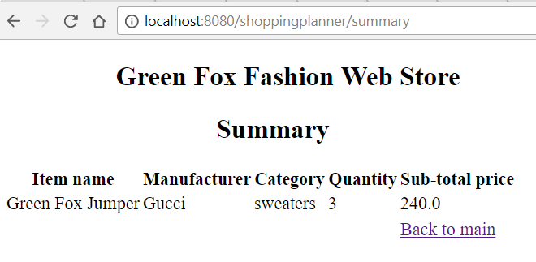

# AvusSIC Orientation Normal Exam

## Getting Started

- **Fork** this repository under your own account
- Clone your forked repository to your computer
- Create a `.gitignore` file so generated files won't be committed
- Commit your progress frequently and with descriptive commit messages
- All your answers and solutions should go in this repository
- Take care of style guide
- Take care of the naming of classes, fields, variables, files, etc.
- Upload your solution to [GradeScope](https://www.gradescope.com/)

## Keep in mind

- You can use any resource online, but **please work individually**
- AI help is not allowed (eg. chatGPT, copilot, ...)
- **Don't just copy-paste** your answers and solutions,
  you need to understand every line of your code
- **Don't push your work** to GitHub until your mentor announces
  that the time is up
- At the end of the exam push your solution to **GitHub** and upload it to **GradeScope**

## Tasks

# Green Fox Fashion Web Store

Build a webshop that people can use to order some merchandise from the Green Fox
store.

## Highlights

### It has a frontend page, which can:

- list all items
- show summary page of the basket

### It has a backend, which can:

- list all items
- process selected items from the form
- list the selected items
- filter items by query parameters
- delete an item by id and payload

## Database

There are two tables, one is `manufacturer` and another is `item`.
In this application, an item can only have one manufacturer, but a manufacturer can
have more items assigned to it.

- manufacturer:

  - `id`
  - `name`

- item:
  - `id`
  - `name`
  - `category`
  - `size`
  - `unit_price`
  - `manufacturer_id`

## Endpoints

### GET `/shoppingplanner`

- The endpoint should render an HTML-page displaying
  the full list of clothes from the database
- It should have:

  - a heading with the title of the site
  - a drop-down list with all the unique name options
  - a drop-down list the following size options:
    - `xs`
    - `s`
    - `m`
    - `l`
    - `xl`
  - an input field to set the quantity of clothes (default value is 1)
  - a GET TOTAL button which posts the data to the `/shoppingplanner/summary` endpoint
  - a table which contains all the clothing items from the database

  

### POST `/shoppingplanner/summary`

The endpoint should calculate the sub-total price of the selected item based on the
quantity and the unit price of the item.

- this endpoint should receive the following information of the selected item from the form:
  - item name
  - size
  - quantity

The page should display the following:

- a heading with the title of the page
- the selected item with its properties:
  - Item name
  - Manufacturer
  - Category
  - Quantity
  - Sub-total price (based on the number of selected items)
- Error scenario:
  When there is no item with the given name and size or when the quantity is 0 or below:
  Do not display the table but an error message on its place saying: "Invalid input"
- a link back to the main page



### GET `/api/item`

- this endpoint should list the clothes based on the query parameters
- the query parameters can be:

  - `manufacturer`
  - `size`

- When the parameters were given,
  then it should respond with the clothes which match with the given parameters
- When only one parameter was given,
  then it should respond with the clothes which match with the given parameter
- When the parameters were not given,
  then it should respond with all the clothes

Example query:

`http://localhost:8080/api/item?manufacturer=Calvin%20Klein&size=s`

- the response should be in JSON format with every clothing item found with status code 200:

```json
{
  "clothes": [
    {
      "id": 21,
      "item_name": "Strecth Steamed Pencil Skirt",
      "manufacturer": "Calvin Klein",
      "category": "skirts",
      "size": "s",
      "unit_price": 39.0
    }
  ]
}
```

In the case of empty list it should return a JSON in the following format

```json
{
  "clothes": []
}
```

### DELETE `/api/item/{id}`

This endpoint deletes the item based on its id.

- example uri: `http://localhost:8080/api/item/1`

In case of a successful operation, the response should be a `204` status code.

In case of incorrect id, send a response with the following error message
and a `404` status code in the following format:

```json
{
  "error-message": "Incorrect provided data"
}
```

### PUT `/api/item/{id}`

This endpoint updates the item based on its id and payload.
Payload must contain correct values of the item:

- All fields are required and should not to be empty: `item_name`, `manufacturer`, `category`, `size`, `unit_price`
- `category` can be anything from the following list:
  `sweaters`,`skirts`, `blouses`, `dresses`, `pants`, `shirts`, `t-shirts`, `jackets`, `coats`
- `size` can be anything from the following list:
  `xs`, `s`, `m`, `l`, `xl`
- `unit_price` must be a positive number
- `manufacturer` must be an existing manufacturer in the database

When the request payload contains invalid data, then it should respond with status code `400`

In case of incorrect id, send a response with the following error message
and a `404` status code in the following format:

```json
{
  "error-message": "Incorrect provided data"
}
```

When all the incoming data is valid,
then it should respond with the updated item in JSON format with status code `200` in the following format:

```json
{
  "id": 1,
  "item_name": "Stretch Steamed Pencil Skirt",
  "manufacturer": "Calvin Klein",
  "category": "skirts",
  "size": "s",
  "unit_price": 45.5
}
```

#### Example request and response

- example HTTP start-line: `PUT http://localhost:8080/api/item/1`
- example request payload:

```json
{
  "item_name": "Stretch Steamed Pencil Skirt",
  "manufacturer": "Calvin Klein",
  "category": "skirts",
  "size": "s",
  "unit_price": 45.5
}
```

- example response:

```json
{
  "id": 1,
  "item_name": "Stretch Steamed Pencil Skirt",
  "manufacturer": "Calvin Klein",
  "category": "skirts",
  "size": "s",
  "unit_price": 45.5
}
```

## Question

Given the following table named `carsForSale`

| carForSaleID | manufacturerName | modelName | acquisitionPrice | dataAcquired |
| :----------: | :--------------: | :-------: | :--------------: | :----------: |
|      1       |    Volkswagen    |   Jetta   |      13300       |  2007-01-07  |
|      2       |     Renault      |  Laguna   |      14700       |  2007-02-12  |
|      3       |       Ford       |   Focus   |      13600       |  2007-03-09  |
|      4       |      Daewoo      |   Tico    |       1100       |  2007-04-17  |
|      5       |      Toyota      |  Avensis  |      14500       |  2007-05-04  |
|      6       |    Alfa Romeo    |    156    |       8700       |  2007-06-23  |
|      7       |    Volkswagen    |  Passat   |      22000       |  2007-07-16  |
|      8       |     Renault      |   Clio    |       6400       |  2007-08-22  |
|      9       |       Ford       |  Fiesta   |       6900       |  2007-09-11  |
|      10      |      Daewoo      |   Cielo   |       3600       |  2007-10-18  |
|      11      |      Toyota      |   Rav4    |      24900       |  2007-11-11  |
|      12      |    Alfa Romeo    |    147    |       7500       |  2007-12-25  |
|      13      |    Volkswaen     |   Golf    |      16700       |  2008-01-14  |
|      14      |     Renault      |  Megane   |      11400       |  2008-02-24  |
|      15      |       Ford       |  Mondeo   |      14600       |  2008-03-18  |
|      16      |      Daewoo      |   Matiz   |       1700       |  2008-04-08  |
|      17      |      Toyota      |   Yaris   |       7400       |  2008-05-02  |
|      18      |    Alfa Romeo    |    159    |      17000       |  2008-06-12  |
|      19      |    Volkswagen    |   Polo    |       6500       |  2008-07-30  |
|      20      |     Renault      |  Scenic   |       6800       |  2008-08-11  |
|      21      |       Ford       |  Escort   |       2000       |  2008-09-22  |
|      22      |      Daewoo      |  Espero   |       2500       |  2008-10-09  |
|      23      |      Toyota      |  Corolla  |      103000      |  2008-11-05  |
|      24      |    Alfa Romeo    |    166    |       5200       |  2008-12-24  |

- Write an SQL query to get all `Renault` cars which are more expensive than
  8000

```
SELECT * FROM carsForSale
WHERE manufacturerName = 'Renault' AND acquisitionPrice > 8000;

```

- Write an SQL query to decrease all `Volkswagen` car's price by 100 units

```

UPDATE carsForSale
SET acquisitionPrice = acquisitionPrice - 100
WHERE manufacturerName = 'Volkswagen';

```

- Find the total number of cars acquired in each month of 2007.

```
SELECT MONTH(dataAcquired), COUNT(*)
FROM carsForSale
WHERE YEAR(dataAcquired) = 2007
GROUP BY MONTH(dataAcquired);

```

- Find out the month and year which had cars acquired with an average price greater than $10,000.

```
SELECT YEAR(dataAcquired), MONTH(dataAcquired)
FROM carsForSale
GROUP BY YEAR(dataAcquired), MONTH(dataAcquired)
HAVING AVG(acquisitionPrice) > 10000;

```
